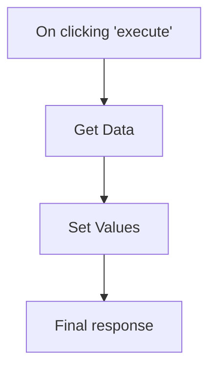

# Documentador n8n

Este skill automatiza a criação de documentação técnica para workflows do n8n a partir de seus arquivos JSON de exportação.

## Requisitos de Saída

A documentação gerada DEVE ser salva na pasta `docs/` na raiz do projeto e seguir a estrutura abaixo:

1.  **Título do Workflow**: Nome do workflow ou descrição geral.
2.  **Visão Geral**: Descrição do que o workflow faz.
3.  **Diagrama de Fluxo**: Um gráfico Mermaid `flowchart TD` representando as conexões entre os nós.
4.  **Detalhamento dos Nós**: Para cada nó no JSON:
    - **Nome do Nó**: O nome atribuído no n8n.
    - **Tipo do Nó**: O tipo oficial do n8n (ex: `n8n-nodes-base.httpRequest`).
    - **Descrição**: Uma explicação detalhada baseada nos parâmetros do nó (o que ele faz, URLs acessadas, credenciais usadas, lógicas aplicadas).
    - **Entradas**: De onde vêm os dados para este nó.
    - **Saídas**: Para onde os dados vão após este nó.

## Instruções de Processamento

### 1. Analisar o JSON
- Identifique a lista de `nodes` e `connections`.
- Mapeie cada nó pelo seu nome único.

### 2. Gerar o Diagrama Mermaid
- Use `flowchart TD`.
- Para cada entrada em `connections`, crie setas: `NoOrigem --> NoDestino`.
- Se houver múltiplas saídas (ex: Switch, If), rotule as setas se possível.

### 3. Descrever os Nós
- Seja específico. Se for um nó de HTTP Request, descreva o método (GET, POST) e o endpoint.
- Se for um nó de Código (Code/Function), resuma a lógica principal do script.
- No campo **Entradas** e **Saídas**, liste os nomes dos nós conectados.

### 4. Salvar o Arquivo
- Nomeie o arquivo como `workflow-<nome-ou-timestamp>.md` dentro da pasta `docs/`.
- Verifique se a pasta `docs/` existe antes de salvar; se não, crie-a.

## Exemplo de Estrutura de Documentação

# [Nome do Workflow]

## Descrição Geral
[Resumo do workflow]

## Flowchart

## Detalhes dos Nós

### 1. [Nome do Nó]
- **Tipo**: `n8n-nodes-base.httpRequest`
- **Descrição**: Faz uma requisição GET para a API X para obter dados de usuários.
- **Entradas**: `Start`
- **Saídas**: `SetData`

---
