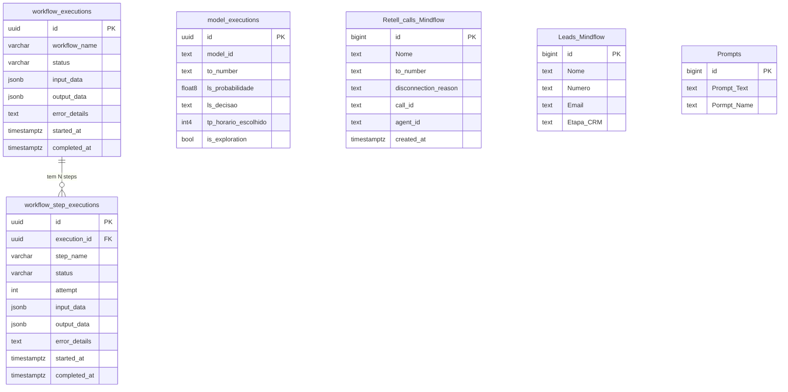

# Guia de Estrutura de Dados — Supabase (MindFlow EDW)

> **Audiência:** Agentes de IA que vão construir ou manter fluxos de automação que interagem com o banco de dados.
> **Objetivo:** Ser a referência definitiva para entender **o que cada tabela guarda**, **como ler e escrever dados** e **como interpretar os valores** em cada campo.

---

## 1. Mapa Geral do Banco

O banco possui **três camadas lógicas** de tabelas:

```
┌─────────────────────────────────────────────────────────────┐
│  CAMADA DE RASTREABILIDADE (EDW) — Padrão Mestre-Detalhe   │
│  workflow_executions  ←─────  workflow_step_executions      │
│  model_executions                                           │
├─────────────────────────────────────────────────────────────┤
│  CAMADA DE DADOS DO NEGÓCIO (Fonte de Dados dos Modelos)   │
│  Retell_calls_Mindflow    Leads_Mindflow                    │
│  Prompts                  Comercial_Mindflow                │
│  Retell_Leads_Midflow                                       │
├─────────────────────────────────────────────────────────────┤
│  CAMADA DE REGRAS / CONTROLE                               │
│  Blacklist_Mindflow    Blacklist_Email                      │
│  Buffer                documents_fil                        │
│  n8n_chat_histories                                         │
└─────────────────────────────────────────────────────────────┘
```

### Diagrama de relacionamentos



---

## 2. Tabelas de Rastreabilidade EDW

> Estas são as tabelas mais críticas. **Todo workflow obrigatoriamente escreve nelas.**

### 2.1 `workflow_executions` — Registro Mestre

**Propósito:** Cada chamada ao webhook cria **exatamente 1 registro** nesta tabela. Ela representa a "capa" de uma execução completa do workflow.

#### Esquema

| Coluna | Tipo | Obrigatório | Descrição |
|---|---|---|---|
| `id` | `uuid` | ✅ (auto) | PK — `uuid_generate_v4()`. É o `execution_id` passado entre todos os nós. |
| `workflow_name` | `varchar` | ✅ | Nome do workflow. Ex: `pre_call_processing`, `call_predict`. |
| `status` | `varchar` | ✅ | Estado da execução. Veja valores válidos abaixo. |
| `input_data` | `jsonb` | ❌ | Payload completo recebido no webhook de entrada. |
| `output_data` | `jsonb` | ❌ | Resultado final do workflow. Preenchido ao concluir. |
| `error_details` | `text` | ❌ | Mensagem de erro em caso de `FAILED`. Stacktrace ou descrição. |
| `started_at` | `timestamptz` | ❌ | Quando o worker começou a processar (UTC). |
| `completed_at` | `timestamptz` | ❌ | Quando o workflow terminou, com sucesso ou falha (UTC). |
| `created_at` | `timestamptz` | ✅ (auto) | Timestamp de criação do registro (UTC). `now()` por padrão. |
| `updated_at` | `timestamptz` | ✅ (auto) | Timestamp da última atualização (UTC). |
| `trigger_event_id` | `varchar` | ❌ | ID do evento externo que disparou este workflow (ex: `execution_id` do workflow pai). |

#### Valores válidos para `status`

| Status | Quando usar |
|---|---|
| `PENDING` | Logo após criar o registro (antes do worker pegar a tarefa). |
| `RUNNING` | Quando o worker começa a executar. |
| `SUCCESS` | Workflow concluído com sucesso (inclui decisões como "DESCARTAR"). |
| `FAILED` | Erro não recuperável. Preencher `error_details`. |

> **Atenção:** `DESCARTAR` é um resultado de **negócio**, não um erro. O status final deve ser `SUCCESS`.

#### Exemplo de registro real

```json
{
  "id": "c535d445-3ca5-4d00-892f-e9e174eed924",
  "workflow_name": "pre_call_processing",
  "status": "SUCCESS",
  "input_data": {
    "nome": "Ivan",
    "email": "ivan@gmail.com",
    "numero": "+5547991089099",
    "agent_id": "agent_0380733a4e3a74142e33500107",
    "Prompt_id": "24",
    "execution_id": "8939723b-2a96-462d-a048-33b0e60b0478",
    "quando_ligar": null,
    "workflow_name": "pre_call_processing"
  },
  "output_data": {
    "status": "Workflow finalizado com sucesso",
    "call_id": "call_3c0ff01e7b39538c38bd9129f46",
    "execution_type": "Scheduled/Immediate (Redis/ARQ)"
  },
  "error_details": null,
  "started_at": "2026-04-23T21:03:42.480274+00:00",
  "completed_at": "2026-04-23T21:03:45.150132+00:00",
  "created_at": "2026-04-23T21:03:42.917948+00:00",
  "trigger_event_id": "8939723b-2a96-462d-a048-33b0e60b0478"
}
```

#### Queries essenciais (Python SDK)

```python
# Criar registro mestre ao receber webhook
execution = supabase.table("workflow_executions").insert({
    "workflow_name": "call_predict",
    "status": "PENDING",
    "input_data": {"numero": numero, "agent_id": agent_id},
    "created_at": datetime.utcnow().isoformat(),
    "updated_at": datetime.utcnow().isoformat(),
}).execute()
execution_id = execution.data[0]["id"]

# Atualizar status para RUNNING ao iniciar processamento
supabase.table("workflow_executions").update({
    "status": "RUNNING",
    "started_at": datetime.utcnow().isoformat(),
    "updated_at": datetime.utcnow().isoformat(),
}).eq("id", execution_id).execute()

# Finalizar com sucesso
supabase.table("workflow_executions").update({
    "status": "SUCCESS",
    "output_data": {"decisao": "LIGAR", "quando_ligar": "2026-04-24T15:00:00-03:00"},
    "completed_at": datetime.utcnow().isoformat(),
    "updated_at": datetime.utcnow().isoformat(),
}).eq("id", execution_id).execute()

# Finalizar com falha
supabase.table("workflow_executions").update({
    "status": "FAILED",
    "error_details": str(exception),
    "completed_at": datetime.utcnow().isoformat(),
    "updated_at": datetime.utcnow().isoformat(),
}).eq("id", execution_id).execute()

# Buscar execuções recentes de um workflow
supabase.table("workflow_executions")\
    .select("*")\
    .eq("workflow_name", "call_predict")\
    .order("created_at", desc=True)\
    .limit(50)\
    .execute()
```

---

### 2.2 `workflow_step_executions` — Registro de Nós (Detalhe)

**Propósito:** Cada **nó** de um workflow gera **1 registro**. É a "trilha de auditoria" detalhada de uma execução. Permite debugar onde e por que um fluxo falhou.

**Relacionamento:** N registros para 1 `workflow_executions.id` (através de `execution_id`).

#### Esquema

| Coluna | Tipo | Obrigatório | Descrição |
|---|---|---|---|
| `id` | `uuid` | ✅ (auto) | PK — `uuid_generate_v4()`. |
| `execution_id` | `uuid` | ✅ | FK → `workflow_executions.id`. Liga o step ao seu workflow mestre. |
| `step_name` | `varchar` | ✅ | Identificador único do nó. Convenção: `{workflow_name}_{descricao_do_no}`. |
| `status` | `varchar` | ✅ | `SUCCESS`, `FAILED`, `RUNNING`. |
| `attempt` | `int` | ✅ (default: 1) | Número da tentativa. Incrementa em caso de retry. |
| `input_data` | `jsonb` | ❌ | Dados de entrada que chegaram ao nó. |
| `output_data` | `jsonb` | ❌ | Resultado produzido pelo nó. |
| `error_details` | `text` | ❌ | Erro do nó, se houver. |
| `started_at` | `timestamptz` | ❌ | Início do nó (UTC). |
| `completed_at` | `timestamptz` | ❌ | Fim do nó (UTC). |
| `created_at` | `timestamptz` | ✅ (auto) | Timestamp de criação (UTC). |

#### Convenção de `step_name`

O nome segue o padrão `{workflow_name}_{descricao_snake_case}`. Exemplos reais:

| Workflow | Step Name | Significado |
|---|---|---|
| `pre_call_processing` | `pre_call_processing_fetch_prompt` | Buscou o prompt no Supabase |
| `pre_call_processing` | `pre_call_processing_format_payload` | Formatou o payload do agente |
| `pre_call_processing` | `pre_call_processing_create_retell_call` | Criou a chamada na Retell AI |
| `call_predict` | `call_predict_input` | Recebeu e validou o webhook |
| `call_predict` | `call_predict_exploitation` | Decidiu exploration vs. normal |
| `call_predict` | `call_predict_get_rows` | Buscou histórico do lead |
| `call_predict` | `call_predict_data_transform_ls` | ETL para o Lead Scoring |
| `call_predict` | `call_predict_run_ls` | Inferência do modelo Lead Scoring |
| `call_predict` | `call_predict_ls_threshold` | Decisão de descartar ou prosseguir |
| `call_predict` | `call_predict_data_transform_tp` | ETL para o Timing Predict |
| `call_predict` | `call_predict_run_tp` | Inferência do modelo Timing Predict |
| `call_predict` | `call_predict_create_payload` | Montagem do payload de saída |
| `call_predict` | `call_predict_send` | Envio para o próximo workflow |

#### Query padrão para criar um step

```python
from datetime import datetime, timezone

step = supabase.table("workflow_step_executions").insert({
    "execution_id": execution_id,  # UUID do workflow mestre
    "step_name": "call_predict_run_ls",
    "status": "RUNNING",
    "attempt": 1,
    "input_data": {"features": features_dict},
    "started_at": datetime.now(timezone.utc).isoformat(),
}).execute()
step_id = step.data[0]["id"]

# Finalizar step
supabase.table("workflow_step_executions").update({
    "status": "SUCCESS",
    "output_data": {"probabilidade": 0.0123, "decisao": "LIGAR"},
    "completed_at": datetime.now(timezone.utc).isoformat(),
}).eq("id", step_id).execute()
```

#### Como ler todos os steps de uma execução

```python
# Ver o fluxo completo de uma execução específica
steps = supabase.table("workflow_step_executions")\
    .select("step_name, status, input_data, output_data, error_details, started_at, completed_at")\
    .eq("execution_id", "c535d445-3ca5-4d00-892f-e9e174eed924")\
    .order("started_at", desc=False)\
    .execute()

for s in steps.data:
    print(f"[{s['status']}] {s['step_name']}")
```

---

### 2.3 `model_executions` — Registros de Inferência ML

**Propósito:** Registra **cada rodada da cascata XGBoost** (Lead Scoring + Timing Predict). É a fonte de dados para auditoria de modelos e retreinamento futuro.

#### Esquema

| Coluna | Tipo | Constraints | Descrição |
|---|---|---|---|
| `id` | `uuid` | PK, `gen_random_uuid()` | Identificador único da inferência. |
| `created_at` | `timestamptz` | NOT NULL | Timestamp UTC da criação. |
| `model_id` | `text` | NOT NULL | Identificador técnico do modelo. Ex: `lead_scoring_v1`. |
| `model_name` | `text` | NOT NULL | Nome legível. Ex: `XGBoost Lead Scoring`. |
| `model_version` | `text` | NOT NULL | Versão semântica. Ex: `1.0.0`. |
| `to_number` | `text` | NOT NULL | Número do lead avaliado (com código de país). |
| `agent_id` | `text` | NOT NULL | ID do agente Retell AI associado ao disparo. |
| `ls_probabilidade` | `float8` | CHECK: `[0, 1]` | Probabilidade bruta de atendimento (Lead Scoring). |
| `ls_decisao` | `text` | CHECK: `'LIGAR'` ou `'DESCARTAR'` | Decisão final do Lead Scoring. |
| `tp_horario_escolhido` | `int4` | CHECK: `[0, 23]` | Hora (0–23) escolhida pelo Timing Predict como melhor horário. |
| `tp_probabilidade_pico` | `float8` | CHECK: `[0, 1]` | Probabilidade de atendimento no horário escolhido. |
| `is_exploration` | `bool` | NOT NULL | `true` = grupo de controle (5%). Pulou a inferência de ML. |

#### Como interpretar os dados

| Cenário | `is_exploration` | `ls_decisao` | `tp_horario_escolhido` | Significado |
|---|---|---|---|---|
| Lead normal aprovado | `false` | `LIGAR` | 15 | Lead passou no LS e o TP escolheu às 15h |
| Lead normal descartado | `false` | `DESCARTAR` | `null` | Lead abaixo do threshold (0.0045) |
| Grupo exploration | `true` | `null` | `null` (ou padrão) | Controle — não usou ML |

#### Queries para o workflow `call_predict`

```python
from datetime import datetime, timezone

# PASSO 1: Inserir com dados do Lead Scoring (run_ls)
record = supabase.table("model_executions").insert({
    "model_id": "lead_scoring_v1",
    "model_name": "XGBoost Lead Scoring",
    "model_version": "1.0.0",
    "to_number": numero,
    "agent_id": agent_id,
    "ls_probabilidade": 0.0123,
    "ls_decisao": "LIGAR",
    "is_exploration": False,
    "created_at": datetime.now(timezone.utc).isoformat(),
}).execute()
model_exec_id = record.data[0]["id"]

# PASSO 2: Atualizar com dados do Timing Predict (run_tp)
supabase.table("model_executions").update({
    "tp_horario_escolhido": 15,
    "tp_probabilidade_pico": 0.087,
}).eq("id", model_exec_id).execute()
```

---

## 3. Tabelas de Dados do Negócio

### 3.1 `Retell_calls_Mindflow` — Histórico de Chamadas

**Propósito:** Registra **cada chamada de voz** realizada pela Retell AI. É a **principal fonte de dados** para os modelos de ML (`call_predict`). Com **3.544+ registros** e crescimento contínuo.

> ⚠️ **RLS está DESABILITADO** nesta tabela. Qualquer chave anon/service tem acesso total.

#### Esquema

| Coluna | Tipo | Descrição |
|---|---|---|
| `id` | `bigint` | PK — auto-increment. |
| `created_at` | `timestamptz` | Timestamp UTC de quando a chamada foi registrada. |
| `Nome` | `text` | Nome do lead. |
| `Email` | `text` | E-mail do lead. |
| `data` | `text` | Data do disparo (formato livre). |
| `Numero` | `text` | Número do lead no formato livre (sem garantia de `+55`). |
| `status` | `text` | Status textual da chamada. Ex: `not_connected`, `connected`. |
| `call_id` | `text` | ID único da chamada na Retell AI. Ex: `call_7b89944d...`. |
| `call_type` | `text` | Tipo de chamada. Ex: `phone_call`. |
| `agent_id` | `text` | ID do agente Retell que realizou a chamada. |
| `agent_version` | `text` | Versão do agente no momento da chamada. |
| `agent_name` | `text` | Nome legível do agente. Ex: `Agente Mindflow Disparo`. |
| `transcript` | `text` | Transcrição completa da conversa (campo longo). |
| `recording_url` | `text` | URL do áudio da chamada. |
| `disconnection_reason` | `text` | **Campo crítico para ML.** Motivo do encerramento. Ver lista abaixo. |
| `eleven_labs_cost` | `text` | Custo de síntese de voz — armazenado como texto. |
| `LLM` | `text` | Provider do LLM usado. |
| `LLM_cost` | `text` | Custo do LLM — armazenado como texto. |
| `combined_cost` | `text` | Custo total da chamada — armazenado como texto. |
| `call_summary` | `text` | Resumo automático da chamada gerado pelo agente. |
| `LLM_token_usage` | `text` | Total de tokens LLM usados. |
| `from_number` | `text` | Número originador da chamada. |
| `to_number` | `text` | **Campo crítico.** Número destino com código de país. Ex: `+5548996027108`. |
| `Duracao` | `text` | Duração da chamada — armazenado como texto. |
| `Marcada` | `text` | Indica se reunião foi marcada (`sim`, `não`, ou vazio). |
| `segmento` | `text` | Segmento de negócio do lead. |
| `equipe` | `text` | Equipe responsável pelo disparo. |

#### Valores conhecidos para `disconnection_reason`

Este campo é usado como feature pelo modelo Lead Scoring:

| Valor | Interpretação |
|---|---|
| `voicemail_reached` | Caiu no correio de voz |
| `dial_no_answer` | Tocou mas não atendeu |
| `inactivity` | Atendeu mas ficou inativo (silêncio) |
| `invalid_destination` | Número inválido |
| `user_hangup` | Lead desligou |
| `user_declined` | Lead recusou a chamada |
| `telephony_provider_permission_denied` | Erro de permissão da operadora |
| `dial_busy` | Linha ocupada |
| `telephony_provider_unavailable` | Operadora indisponível |
| `agent_hangup` | Agente desligou (fluxo normal ao fim da conversa) |
| `error_asr` | Erro de reconhecimento de voz (ASR) |
| `error_retell` | Erro interno da Retell |
| `dial_failed` | Falha na discagem |
| `max_duration_reached` | Atingiu duração máxima |
| `ivr_reached` | Caiu em URA/menu automático |
| `no-answer` | ⚠️ Valor legado — semanticamente igual a `dial_no_answer`. Tratar como tal. |

#### Query utilizada pelo `call_predict` (Nó 3)

```python
# Busca histórico de chamadas de um número específico
# ⚠️ Ordenação DESC + limit 150 garante que pegamos as linhas mais recentes
response = supabase.table("Retell_calls_Mindflow")\
    .select("to_number, created_at, disconnection_reason, call_id")\
    .eq("to_number", numero)\
    .order("created_at", desc=True)\
    .limit(150)\
    .execute()

# Deduplicação por call_id (manter o evento mais recente de cada ligação)
seen_call_ids = set()
deduplicated_rows = []
for row in response.data:
    c_id = row.get("call_id")
    if c_id:
        if c_id not in seen_call_ids:
            deduplicated_rows.append(row)
            seen_call_ids.add(c_id)
    else:
        deduplicated_rows.append(row)

# Reverter para ASC (cronológico) para cálculos corretos de features
rows = list(reversed(deduplicated_rows))
```

---

### 3.2 `Leads_Mindflow` — CRM de Leads do WhatsApp

**Propósito:** CRM interno de leads captados via **WhatsApp**. Armazena dados cadastrais e estado de relacionamento comercial.

> ⚠️ **ATENÇÃO — Canal distinto:** Esta tabela é **independente** de `Retell_calls_Mindflow`. Os leads aqui chegam via WhatsApp/Instagram, **não** via ligação telefônica da Retell AI. Não assumir que um lead em `Leads_Mindflow` possui histórico em `Retell_calls_Mindflow` e vice-versa.

> ⚠️ **RLS HABILITADO.** Usar `service_role` key para acesso.

#### Esquema

| Coluna | Tipo | Descrição |
|---|---|---|
| `id` | `bigint` | PK — auto-increment. |
| `created_at` | `timestamptz` | Data de criação do registro. |
| `Nome` | `text` | Nome completo do lead. |
| `Número` | `text` | Telefone do lead (formato variável). **Atenção ao acento.** |
| `data ultima msgm` | `text` | Data da última mensagem recebida. |
| `Ultima msgm (texto)` | `text` | Conteúdo da última mensagem recebida. |
| `Etapa CRM` | `text` | Estágio no funil de vendas. |
| `Reunião Marcada` | `text` | Indica se uma reunião foi agendada. |
| `Fechou` | `text` | Indica se o lead fechou negócio. |
| `CRM_Card_ID` | `text` | ID do card no CRM externo. |
| `Email` | `text` | E-mail do lead. |
| `causa_raiz` | `text` | Diagnóstico de abandono ou desistência. |
| `transcricao` | `text` | Transcrição relevante de uma conversa. |
| `drop_state` | `text` | Estado de abandono do funil. |

```python
# Buscar um lead pelo número de telefone
# ⚠️ Campo "Número" tem acento — copiar exatamente
lead = supabase.table("Leads_Mindflow")\
    .select("Nome, Email, \"Etapa CRM\", \"Reunião Marcada\"")\
    .eq("Número", numero)\
    .limit(1)\
    .execute()
```

---

### 3.3 `Prompts` — Biblioteca de Prompts dos Agentes

**Propósito:** Armazena os prompts de sistema injetados nos agentes Retell AI durante o `pre_call_processing`.

> ⚠️ **RLS HABILITADO.** Usar `service_role` key.

#### Esquema

| Coluna | Tipo | Descrição |
|---|---|---|
| `id` | `bigint` | PK. O `Prompt_id` do payload webhook refere-se a este campo. |
| `created_at` | `timestamptz` | Data de criação. |
| `Nome do cliente` | `text` | Nome do cliente/empresa associado ao prompt. |
| `Prompt_Text` | `text` | Texto completo do prompt (com templates `{{ variavel }}`). |
| `Ligação/txt` | `text` | Canal: ligação ou WhatsApp/texto. |
| `Pormpt_Name` | `text` | Nome identificador do prompt (**typo no banco — respeitar**). |
| `Prompt Insta` | `text` | Prompt específico para Instagram. |

```python
# Buscar prompt pelo ID recebido no payload
prompt_id = payload["Prompt_id"]  # Ex: "24"

prompt = supabase.table("Prompts")\
    .select("Prompt_Text, Pormpt_Name")\
    .eq("id", int(prompt_id))\
    .single()\
    .execute()

raw_prompt_text = prompt.data["Prompt_Text"]

# Substituir variáveis no template:
# {customer_name} → nome do lead
# {data_atual_iso} → datetime.now(BRT).isoformat()
# {email} → email do lead
# {empresa} → nome da empresa do lead
# {segmento} → segmento do lead
# {numero_do_lead} → número com código do país
```

---

### 3.4 `Comercial_Mindflow` — Movimentações do CRM

**Propósito:** Log de eventos de movimentação de cards em CRM externo (Trello).

| Coluna | Tipo | Descrição |
|---|---|---|
| `id` | `bigint` | PK. |
| `created_at` | `timestamptz` | Data do evento. |
| `Board_Name` | `text` | Nome do quadro no CRM. |
| `board_id` | `text` | ID do board. |
| `Moved_to` | `text` | Lista para qual o card foi movido. |
| `List_id` | `text` | ID da lista de destino. |
| `Data` | `text` | Data do movimento (formato texto livre). |
| `Membro` | `text` | Membro responsável pela movimentação. |

---

### 3.5 `Retell_Leads_Midflow` (Legado — NÃO USAR)

> ⚠️ Esta tabela tem comentário no banco: *"This is a duplicate of Retell_Leads"*. **Não usar para novas funcionalidades.** Preferir `Retell_calls_Mindflow`.

---

## 4. Tabelas de Controle

### 4.1 `Blacklist_Mindflow` — Números Bloqueados

```python
# Verificar antes de qualquer disparo
blacklist_check = supabase.table("Blacklist_Mindflow")\
    .select("id")\
    .eq("Número", numero)\
    .execute()

if blacklist_check.data:
    raise ValueError(f"Número {numero} está na blacklist. Abortando workflow.")
```

### 4.2 `Blacklist_Email` — E-mails Bloqueados

| Coluna | Descrição |
|---|---|
| `Email` | E-mail bloqueado. |

### 4.3 `Buffer` — Mensagens em Espera

| Coluna | Descrição |
|---|---|
| `Número` | Número do remetente (com acento). |
| `Mensagem` | Conteúdo da mensagem. |

---

## 5. Convenções Críticas para Agentes

### 5.1 Datas e Timezone

- **Persistência no banco:** Sempre em **UTC (ISO 8601)**. Ex: `2026-04-24T18:00:00+00:00`.
- **Manipulação interna:** Em `America/Sao_Paulo` (BRT, UTC-3).

```python
from datetime import datetime, timezone
from zoneinfo import ZoneInfo

# Agora em UTC para persistir no banco
now_utc = datetime.now(timezone.utc).isoformat()

# Agora em BRT para lógica de negócio
now_br = datetime.now(ZoneInfo("America/Sao_Paulo"))

# Converter string do banco (UTC) para BRT
created_at_str = "2026-04-24T18:00:00+00:00"
created_at_br = datetime.fromisoformat(created_at_str).astimezone(ZoneInfo("America/Sao_Paulo"))
```

### 5.2 Formato de Número de Telefone

- **Padrão obrigatório:** `+55DDXXXXXXXXX`. Ex: `+5547991089099`.
- **`to_number`** em `Retell_calls_Mindflow` segue este padrão.
- **`Número`** em `Leads_Mindflow` pode ter formato variado — sanitizar antes de usar.
- Extração do DDD: `numero[3:5]` (posições 3 e 4 do string `+55DDXXXXXXXX`).

### 5.3 Campos com Nomes Especiais no Banco

| Tabela | Campo exato | Observação |
|---|---|---|
| `Blacklist_Mindflow` | `Número` | Com acento |
| `Leads_Mindflow` | `Número` | Com acento |
| `Leads_Mindflow` | `data ultima msgm` | Com espaços |
| `Leads_Mindflow` | `Ultima msgm (texto)` | Com parênteses |
| `Leads_Mindflow` | `Etapa CRM` | Com espaço |
| `Leads_Mindflow` | `Reunião Marcada` | Com acento e espaço |
| `Prompts` | `Pormpt_Name` | **Typo intencional** — sem "p" em "prompt" |
| `Prompts` | `Nome do cliente` | Com espaços |
| `Prompts` | `Ligação/txt` | Com acento e barra |
| `Prompts` | `Prompt Insta` | Com espaço |
| `Buffer` | `Número` | Com acento |
| `Buffer` | `Mensagem` | Com acento |

### 5.4 Campos de Custo em Texto

Em `Retell_calls_Mindflow`, os campos de custo são `text`, não números:
```python
custo = float(row.get("combined_cost") or 0)
duracao = float(row.get("Duracao") or 0)
```

### 5.5 Status de RLS por Tabela

| Tabela | RLS | Estratégia de acesso |
|---|---|---|
| `workflow_executions` | ❌ Desabilitado | Anon key funciona |
| `workflow_step_executions` | ❌ Desabilitado | Anon key funciona |
| `model_executions` | ❌ Desabilitado | Anon key funciona |
| `Retell_calls_Mindflow` | ❌ Desabilitado | Anon key funciona |
| `Leads_Mindflow` | ✅ Habilitado | Usar `service_role` key |
| `Prompts` | ✅ Habilitado | Usar `service_role` key |
| `Blacklist_Mindflow` | ✅ Habilitado | Usar `service_role` key |
| `Comercial_Mindflow` | ✅ Habilitado | Usar `service_role` key |
| `Buffer` | ✅ Habilitado | Usar `service_role` key |

---

## 6. Receitas de Query para Cenários Comuns

### Rastrear uma execução completa

```python
exec_id = "c535d445-3ca5-4d00-892f-e9e174eed924"

# 1. Registro mestre
master = supabase.table("workflow_executions").select("*").eq("id", exec_id).single().execute()

# 2. Todos os steps em ordem cronológica
steps = supabase.table("workflow_step_executions")\
    .select("step_name, status, output_data, error_details, started_at")\
    .eq("execution_id", exec_id)\
    .order("started_at", desc=False)\
    .execute()

# 3. Inferência de ML associada
numero = master.data["input_data"]["numero"]
ml = supabase.table("model_executions")\
    .select("*")\
    .eq("to_number", numero)\
    .order("created_at", desc=True)\
    .limit(1)\
    .execute()
```

### Diagnosticar execução que falhou

```python
failed_steps = supabase.table("workflow_step_executions")\
    .select("step_name, error_details, input_data, attempt")\
    .eq("execution_id", exec_id)\
    .eq("status", "FAILED")\
    .execute()

for s in failed_steps.data:
    print(f"Falhou em: {s['step_name']} (tentativa {s['attempt']})")
    print(f"Erro: {s['error_details']}")
```

### Buscar histórico de um número para ML

```python
def get_historico(numero: str) -> list[dict]:
    """Todas as tentativas de chamada para um número, em ordem cronológica."""
    return supabase.table("Retell_calls_Mindflow")\
        .select("to_number, created_at, disconnection_reason")\
        .eq("to_number", numero)\
        .order("created_at", desc=False)\
        .limit(100)\
        .execute().data
```

### Verificar taxa de sucesso nas últimas 24h

```python
from datetime import datetime, timedelta, timezone

since = (datetime.now(timezone.utc) - timedelta(hours=24)).isoformat()

execucoes = supabase.table("workflow_executions")\
    .select("status")\
    .eq("workflow_name", "call_predict")\
    .gte("created_at", since)\
    .execute()

total = len(execucoes.data)
sucesso = sum(1 for e in execucoes.data if e["status"] == "SUCCESS")
falha = sum(1 for e in execucoes.data if e["status"] == "FAILED")
print(f"Total: {total} | Sucesso: {sucesso} | Falha: {falha}")
```

---

## 7. Padrão Mestre-Detalhe (Resumo Visual)

```
POST /webhook/predict
        │
        ▼
workflow_executions (1 linha)
├── id: "uuid-do-workflow"
├── status: PENDING → RUNNING → SUCCESS/FAILED
├── input_data: { numero, agent_id }
└── output_data: { decisao, quando_ligar }
        │
        ├── workflow_step_executions (N linhas, uma por nó)
        │   ├── call_predict_input           → SUCCESS
        │   ├── call_predict_exploitation    → SUCCESS
        │   ├── call_predict_get_rows        → SUCCESS
        │   ├── call_predict_data_transform_ls → SUCCESS
        │   ├── call_predict_run_ls          → SUCCESS
        │   ├── call_predict_ls_threshold    → SUCCESS
        │   ├── call_predict_data_transform_tp → SUCCESS (apenas se LS aprovado)
        │   ├── call_predict_run_tp          → SUCCESS (apenas se LS aprovado)
        │   ├── call_predict_create_payload  → SUCCESS (apenas se LS aprovado)
        │   └── call_predict_send            → SUCCESS (apenas se LS aprovado)
        │
        └── model_executions (1 linha por execução de ML)
            ├── ls_probabilidade: 0.0123
            ├── ls_decisao: "LIGAR"
            ├── tp_horario_escolhido: 15
            └── is_exploration: false
```

---

*Documento gerado via MCP Supabase + inspeção do banco em produção.*
*Última atualização: 2026-04-24. Manter sincronizado com mudanças de schema.*
